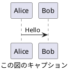

# CLAUDE.md

This file provides guidance to Claude Code (claude.ai/code) when working with code in this repository.

このファイルは、このリポジトリでコードを扱う際の Claude Code (claude.ai/code) への指針を提供します。

<important_rules>
性能改善やリファクタリングを要求された際は、オリジナルのソース解説コメントを維持してください。

**編集に関するルール**

編集を行う際は、編集の目的が精度向上であることを念頭において作業してください。
目的があいまいな場合は、以下のどの編集行為を行うとしているのか、ユーザーに問い合わせてください。

以下が一般的な編集です。

+ Polish: 仕上げの微調整、表現をなめらかにする
+ Refine: 不要部分を削り、精度を高める
+ Edit: 全般的な編集、誤字修正から大幅改変まで幅広い
+ Revise: 内容や構成を再検討して修正

以下の編集は、明確な書き直しや書き換えの指示がない限り、実施しないでください。

+ Rewrite: 大きく書き直す（意味も変わることあり）
+ Rephrase: 同じ意味を別の言い回しで表す
+ Reword: 特定の単語や表現を置き換える
+ Paraphrase: 意味を保ったまま言い換える

**単語の強制**

以下に示す単語は、同義語、同じ意味の他言語の単語に優先して使用すること。

+ Markdown

**表記に関するルール**

このルールは、**ソースコード内のコメントでも有効** です。

+ 本文の文末を `：` で終わらせないでください。きちんと文章として完結させてください。
+ 全角括弧 `（` `）` や全角コロン `：` は使用せず、半角で記述してください。
+ 日本語と英単語の間は、半角スペースを挿入してください。
+ 見出し (#, ##, ...) と本文の間、および、本文とコードブロックの間は、空行を挿入してください。
+ 見出し (#, ##, ...) と見出し (#, ##, ...) の間に水平線 (`----`) を挿入しないでください。
+ 見出し (#, ##, ...) に続く文字列に番号 (1. など) を付与しないでください。
+ 絵文字の使用は最低限度の使用にしてください。シンプルな意味論を持つ絵文字として ✅, ❌, 🟢, 🟡, 🔴 などは許容します。
+ 特に言語の指定のないコードブロックの場合でも、'```text' のように形式を明示してください。

**図に関するルール**

ユーザーに図を提示する際は、原則として、PlantUML 形式としてください。  
plantuml コードブロックへのファイル名付与は不要です。  
PlantUML による記法では、`@startuml` と `caption` に同じタイトル文字列を付与してください。 `title` は使用しないでください。以下に例を示します。



PlantUML にてフローを説明する際は、アクティビティ図を優先してください。  
シーケンスに着目すべき内容の説明、および、シーケンス図を要求された場合は、シーケンス図としてください。  
適切であると判断された場合は、他の PlantUML 形式も活用してください。

PlantUML 形式での表現が困難な場合は、marmaid 形式としてください。  
marmaid による記法では、コードブロックの caption にタイトル文字列を付与してください。以下に例を示します。

```{.mermaid caption="Mermaid の図キャプション"}
sequenceDiagram
    Alice->>John: Hello John, how are you?
```

指示があった場合は、draw.io にインポート可能な xml の提示をしてください。  
</important_rules>

## プロジェクト概要

これは、Doxygen ドキュメント生成のための設定・テンプレート・スクリプト群を提供するフレームワークです。本リポジトリはメインプロジェクトからサブモジュール doxyfw として参照され、以下の機能を提供します。

- Doxygen 基本設定ファイル
- Markdown 変換用の Doxybook2 設定・テンプレート
- XML 前処理・後処理スクリプト
- 日本語ドキュメント出力用のカスタムテンプレート

## 主要コマンド

### ドキュメント生成

```bash
make docs
```

このコマンドは以下の処理を順次実行します。

1. メインプロジェクトに `Doxyfile.part` が存在する場合、基本設定ファイルと結合して一時ファイルを作成し使用 (設定のオーバーライド対応)
2. メインプロジェクトの `prod/` ディレクトリから C ソースファイルを解析し、`xml/` に Doxygen XML ファイルと `docs/doxygen/html/` に HTML ファイルを生成
3. `templates/preprocess.sh` で XML ファイルを前処理 (PlantUML タグ、パラメータ direction 属性、linebreak タグを変換)
4. Doxybook2 で XML を `docs-src/doxybook/` の Markdown に変換 (カスタム日本語テンプレート使用)
5. `templates/postprocess.sh` で `!include` ディレクティブを処理して関連コンテンツを統合

### クリーンアップ

```bash
make clean
```

生成されたドキュメント (`docs/doxygen`、`docs-src/doxybook`、`xml`) を削除します。

## アーキテクチャ

### プロジェクト構造 (サブモジュール前提)

```text
main-project/                     # メインプロジェクト
├── doxyfw/                    # 本リポジトリ (git submodule)
│   ├── Doxyfile              # Doxygen 基本設定
│   ├── doxybook-config.json  # Doxybook2 設定
│   ├── templates/            # カスタム日本語テンプレート群
│   │   ├── *.tmpl           # Jinja2 テンプレートファイル
│   │   ├── preprocess.sh    # XML 前処理スクリプト
│   │   └── postprocess.sh   # Markdown 後処理スクリプト
│   ├── docs-src/             # 技術ドキュメント
│   └── Makefile              # ドキュメント生成用 Makefile
├── Doxyfile.part              # プロジェクト固有設定 (オプション)
├── prod/src/                  # 実際の C ソースコード
├── docs/doxygen/html/         # Doxygen 生成 HTML 出力
├── docs-src/doxybook/         # Doxybook2 生成 Markdown 出力
└── xml/                       # Doxygen XML 中間ファイル
```

### ソースコード構造

- `prod/src/calculator.h` - 関数宣言と `@ingroup public_api` による API 分類、ZERO_DEVIDE 定数定義
- `prod/src/calculator.c` - `@ingroup public_api` を使用した Doxygen コメント付きの実装
- `prod/src/samplestruct.h` - UserInfo 構造体とその他のサンプル定義

### ドキュメント生成パイプライン

1. Doxygen: C ソースファイルを解析し、`Doxyfile` 設定に基づいて XML ファイルと HTML ドキュメントを生成
2. プリプロセッシング: `preprocess.sh` スクリプトが変換前に XML ファイルを処理
3. Doxybook2: `doxybook-config.json` とカスタムテンプレートを使用して Doxygen XML を Markdown に変換
4. ポストプロセッシング: `postprocess.sh` スクリプトが `!include` ディレクティブを処理して関連コンテンツを統合、不要ファイルを削除

### 主要設定ファイル

- `Doxyfile` - Doxygen 基本設定 (UTF-8 エンコーディング、全要素抽出、PlantUML 対応)
- メインプロジェクトの `Doxyfile.part` - プロジェクト固有の設定オーバーライド (存在時は基本設定に追加結合)
- `doxybook-config.json` - Doxybook2 設定 (ソートあり、フォルダ使用なし、.md 拡張子)
- `config/templates/` - 日本語フォーマット用のカスタムテンプレート群

### 処理スクリプト詳細

#### templates/preprocess.sh (前処理)

Doxybook2 変換前の XML ファイル前処理を実行します。

- PlantUML タグ（`<plantuml>` → "```plantuml\n@startuml"、`</plantuml>`→"@enduml\n```"）
- パラメータ direction 属性 (`direction="in"`→`[in]` プレフィックス追加)
- linebreak タグ（`<linebreak/>` → 改行文字への変換準備）

#### templates/postprocess.sh (後処理)

Doxybook2 変換後の Markdown ファイル後処理を実行します。

- インクルードディレクティブ: `!include filename.md` でファイル内容を統合
- Markdown 整形: YAML フロントマター空行除去、連続空行統合、行末空白除去を処理
- ファイルクリーンアップ: 不要な `struct*.md`、`index_classes.md` 等を削除

### カスタムテンプレート

`templates/` 内に日本語ドキュメント用のカスタムテンプレートを配置しています。

- `nonclass_members_details.tmpl` - API 出力セクション組織化のメインテンプレート
- `member_details.tmpl` - 関数・構造体等の個別要素書式設定
- `details.tmpl` - パラメータ・戻り値・警告等の共通書式

## 開発ガイド

### Doxygen 仕様とベストプラクティス

- 全パブリック関数に `@ingroup public_api` を付与して API をグループ化
- PlantUML サポート (前提: `Doxyfile` に `PLANTUML_JAR_PATH` が設定されていること)
- UTF-8 エンコーディングで日本語コメント対応
- 関数宣言はヘッダーで簡潔に、詳細実装コメントは .c ファイルに記述
- プロジェクト固有設定はメインプロジェクトの `Doxyfile.part` で上書き (PROJECT_NAME 等)

### テンプレート開発時の注意点

- `!include` ディレクティブで関連コンテンツ統合 (例: 構造体詳細をグループページに統合)
- 相対パス・絶対パス両方をサポート
- デバッグ時は `templates/postprocess.sh` 内の `set -x` のコメントアウト解除
