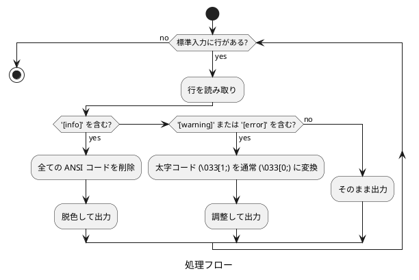

# doxybook2-decolorize-output.sh 仕様

## 概要

`doxybook2-decolorize-output.sh` は、Doxybook2 の出力メッセージから過剰な ANSI カラーコードを除去するフィルタースクリプトです。`[info]` ログを完全に脱色し、`[warning]` と `[error]` の太字を除去します。

## ファイルパス

```text
doxybook2-decolorize-output.sh
```

## 実行権限

実行可能 (chmod +x)

## 機能

標準入力から受け取った各行を解析し、ログレベルに応じて ANSI カラーコードを除去または調整します。

### 処理ルール

| ログレベル | 検出パターン | 処理内容 | 処理後の表示 |
|------------|--------------|----------|--------------|
| Info | `[info]` | 全ての ANSI コードを削除 | デフォルト (着色なし) |
| Warning | `[warning]` | 太字コードを除去、黄色は維持 | 🟡 黄 (通常の太さ) |
| Error | `[error]` | 太字コードを除去、赤色は維持 | 🔴 赤 (通常の太さ) |
| その他 | (該当なし) | そのまま出力 | 変更なし |

## 実装詳細

### 処理フロー



### マッチング条件

#### Info ログの検出

```bash
if [[ "$line" == *"[info]"* ]]; then
```

行内に `[info]` が含まれる場合にマッチします。

#### Warning/Error ログの検出

```bash
elif [[ "$line" == *"[warning]"* ]] || [[ "$line" == *"[error]"* ]]; then
```

行内に `[warning]` または `[error]` が含まれる場合にマッチします。

### ANSI エスケープコードの除去・変換

#### Info ログの完全脱色

```bash
# 全ての ANSI エスケープコード (\033[XXm 形式) を削除
echo "$line" | sed 's/\x1b\[[0-9;]*m//g'
```

正規表現の説明:
- `\x1b`: ESC 文字 (8 進数 033)
- `\[`: 左角括弧
- `[0-9;]*`: 数字とセミコロンの 0 回以上の繰り返し
- `m`: 終端文字

#### Warning/Error ログの太字除去

```bash
# 太字コード (\033[1;XX) を通常の太さ (\033[0;XX) に変換
echo "$line" | sed 's/\x1b\[1;/\x1b[0;/g'
```

変換例:
- `\033[1;33m` (太字 + 黄色) → `\033[0;33m` (通常 + 黄色)
- `\033[1;31m` (太字 + 赤色) → `\033[0;31m` (通常 + 赤色)

### 設計上の考慮事項

#### Doxygen 着色スクリプトとの対比

| 項目 | doxygen-colorize-output.sh | doxybook2-decolorize-output.sh |
|------|----------------------------|--------------------------------|
| 目的 | 着色を **追加** | 着色を **削除/調整** |
| 対象 | error, warning | info, warning, error |
| 処理 | ANSI コードを付与 | ANSI コードを除去/変換 |
| 理由 | 着色が不足 | 着色が過剰 |

#### パターンマッチングの簡潔性

`[info]` の形式は、スペースを含まない明確なパターンであるため、誤検知の可能性が低く、シンプルなマッチングで十分です。

## 使用方法

### Makefile からの呼び出し

```bash
doxybook2 -i ../xml -o ../docs-src/doxybook --config doxybook-config.json --templates templates 2>&1 | $(MAKEFILE_DIR)/doxybook2-decolorize-output.sh
```

- `2>&1`: stderr を stdout にリダイレクトして結合
- `|`: パイプでフィルタースクリプトに渡す

### 終了コードの保持

```bash
doxybook2 -i ../xml -o ../docs-src/doxybook --config doxybook-config.json --templates templates 2>&1 | $(MAKEFILE_DIR)/doxybook2-decolorize-output.sh;
DOXYBOOK_EXIT=${PIPESTATUS[0]};
exit $DOXYBOOK_EXIT;
```

`PIPESTATUS[0]` を使用して、パイプの最初のコマンド (doxybook2) の終了コードを取得し、ビルドの成否を正しく判定します。

## 出力例

### 処理前

```text
[2025-11-26 10:30:15.123] [info] Processing file calculator.h
[2025-11-26 10:30:15.124] [warning] Missing brief description
[2025-11-26 10:30:15.125] [error] Failed to parse member
```

(ターミナルでは `[info]` が緑、`[warning]` が太字黄色、`[error]` が太字赤色で表示)

### 処理後

```text
[2025-11-26 10:30:15.123] [info] Processing file calculator.h
```
<span style="color: #ffaa00">[2025-11-26 10:30:15.124] [warning] Missing brief description</span>
<span style="color: #ff0000">[2025-11-26 10:30:15.125] [error] Failed to parse member</span>

(`[info]` は着色なし、`[warning]` は通常の太さの黄色、`[error]` は通常の太さの赤色で表示)

## 制限事項

### ANSI カラーコード非対応環境

元々 ANSI カラーコードに対応していないターミナルでは、Doxybook2 自体が着色を出力しないため、本スクリプトの効果はありません。

### ログファイルへの出力

ANSI カラーコードを含む出力をファイルにリダイレクトする場合、本スクリプトを適用することで、ログファイルに不要なエスケープシーケンスが含まれることを防げます。

```bash
# 推奨: フィルターを適用してログファイルに保存
doxybook2 ... 2>&1 | doxybook2-decolorize-output.sh | tee doxybook2.log
```

## テスト方法

以下のコマンドでスクリプト単体のテストが可能です。

```bash
cat <<'EOF' | doxybook2-decolorize-output.sh
Normal output line
[2025-11-26 10:30:15.123] [info] Processing file
Another normal line
[2025-11-26 10:30:15.124] [warning] Missing description
[2025-11-26 10:30:15.125] [error] Parse failed
More normal output
EOF
```

期待される結果:
- `[info]` 行: ANSI コードが完全に削除される
- `[warning]` 行: 太字が除去され、通常の太さの黄色になる
- `[error]` 行: 太字が除去され、通常の太さの赤色になる

実際の ANSI コードを含むテストは以下の通りです。

```bash
cat <<'EOF' | doxybook2-decolorize-output.sh
Normal output line
[2025-11-26 10:30:15.123] [32m[info][0m Processing file
[2025-11-26 10:30:15.124] [1;33m[warning][0m Missing description
[2025-11-26 10:30:15.125] [1;31m[error][0m Parse failed
EOF
```

## 関連ファイル

- `Makefile`: 本スクリプトを doxybook2 実行時に適用
- `docs-src/doxybook2-decolorize-output-research.md`: 調査結果と背景情報
- `doxygen-colorize-output.sh`: Doxygen 用の着色スクリプト (対比参考)
