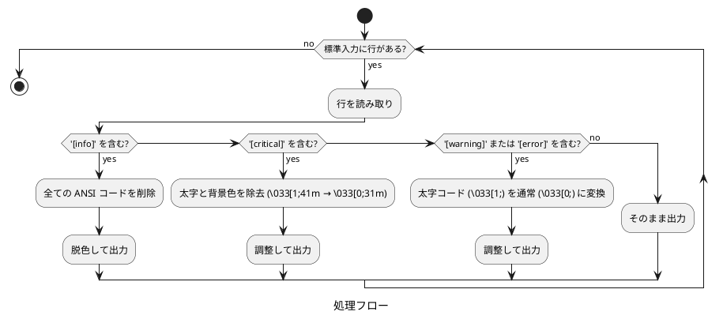

# doxybook2-decolorize-output.sh 仕様

## 概要

`doxybook2-decolorize-output.sh` は、Doxybook2 の出力メッセージから過剰な ANSI カラーコードを除去するフィルタースクリプトです。`[info]` ログを完全に脱色し、`[warning]` / `[error]` / `[critical]` の太字を除去します。

## 背景と目的

### 問題点

Doxybook2 は spdlog ライブラリを使用してログ出力を行っており、デフォルトで ANSI カラーコードによる着色が有効になっています。実行時、以下の問題が発生します。

- `[info]` レベルのログが緑色で大量に出力され、視認性が低下する
- Doxygen とは逆に、着色が過剰である
- `[info]` は情報メッセージであり、着色の必要性が低い
- `[warning]`、`[error]`、`[critical]` の太字も、強調が過剰である
- `[critical]` の赤背景も過剰であり、通常の赤文字で十分である

### 目標

Doxygen 着色スクリプト (`doxygen-colorize-output.sh`) とは逆のアプローチを採用します。

- 着色の削除: 過剰な ANSI エスケープコードを除去
- 選択的処理: `[info]` は完全脱色、`[warning]` / `[error]` / `[critical]` は太字を除去
- 単語のみ着色: すべてのログレベルで、`[単語]` のみが着色される

## ファイルパス

```text
doxybook2-decolorize-output.sh
```

## 実行権限

実行可能 (chmod +x)

## 機能

標準入力から受け取った各行を解析し、ログレベルに応じて ANSI カラーコードを除去または調整します。

### 処理ルール

| ログレベル | 検出パターン | 処理内容 | 処理後の表示 |
|------------|--------------|----------|--------------|
| Info | `[info]` | 全ての ANSI コードを削除 | デフォルト (着色なし) |
| Critical | `[critical]` | 太字と背景色を除去し、赤色に変換 | 🔴 赤 (通常の太さ、背景なし) |
| Warning | `[warning]` | 太字コードを除去、黄色は維持 | 🟡 黄 (通常の太さ) |
| Error | `[error]` | 太字コードを除去、赤色は維持 | 🔴 赤 (通常の太さ) |
| その他 | (該当なし) | そのまま出力 | 変更なし |

## 実装詳細

### 処理フロー


```plantuml
@startuml 処理フロー
caption 処理フロー

start
while (標準入力に行がある?) is (yes)
  :行を読み取り;
  if ('[info]' を含む?) then (yes)
    :全ての ANSI コードを削除;
    :脱色して出力;
  elseif ('[critical]' を含む?) then (yes)
    :太字と背景色を除去 (\\033[1;41m → \\033[0;31m);
    :調整して出力;
  elseif ('[warning]' または '[error]' を含む?) then (yes)
    :太字コード (\\033[1;) を通常 (\\033[0;) に変換;
    :調整して出力;
  else (no)
    :そのまま出力;
  endif
endwhile (no)
stop

@enduml
```

### マッチング条件

#### Info ログの検出

```bash
if [[ "$line" == *"[info]"* ]]; then
```

行内に `[info]` が含まれる場合にマッチします。

#### Critical ログの検出

```bash
elif [[ "$line" == *"[critical]"* ]]; then
```

行内に `[critical]` が含まれる場合にマッチします。

#### Warning/Error ログの検出

```bash
elif [[ "$line" == *"[warning]"* ]] || [[ "$line" == *"[error]"* ]]; then
```

行内に `[warning]` または `[error]` が含まれる場合にマッチします。

### ANSI エスケープコードの除去・変換

#### Info ログの完全脱色

```bash
# 全ての ANSI エスケープコード (\033[XXm 形式) を削除
echo "$line" | sed 's/\x1b\[[0-9;]*m//g'
```

正規表現の説明:
- `\x1b`: ESC 文字 (8 進数 033)
- `\[`: 左角括弧
- `[0-9;]*`: 数字とセミコロンの 0 回以上の繰り返し
- `m`: 終端文字

#### Critical ログの太字と背景色の除去

```bash
# 太字と背景色を除去し、通常の赤文字に変換
# \033[1;41m → \033[0;31m (太字 + 赤背景 → 通常 + 赤文字)
echo "$line" | sed 's/\x1b\[1;41m/\x1b[0;31m/g'
```

処理内容:
- 太字 + 赤背景 (`\033[1;41m`) を通常の赤文字 (`\033[0;31m`) に変換
- `[critical]` という単語のみが赤色で表示される

#### Warning/Error ログの太字除去

```bash
# 太字コード (\033[1;XX) を通常の太さ (\033[0;XX) に変換
echo "$line" | sed 's/\x1b\[1;/\x1b[0;/g'
```

変換例:
- `\033[1;33m` (太字 + 黄色) → `\033[0;33m` (通常 + 黄色)
- `\033[1;31m` (太字 + 赤色) → `\033[0;31m` (通常 + 赤色)

### 設計上の考慮事項

#### Doxygen 着色スクリプトとの対比

| 項目 | doxygen-colorize-output.sh | doxybook2-decolorize-output.sh |
|------|----------------------------|--------------------------------|
| 目的 | 着色を追加 | 着色を削除/調整 |
| 対象 | error, warning | info, warning, error |
| 処理 | ANSI コードを付与 | ANSI コードを除去/変換 |
| 理由 | 着色が不足 | 着色が過剰 |

#### パターンマッチングの簡潔性

`[info]` の形式は、スペースを含まない明確なパターンであるため、誤検知の可能性が低く、シンプルなマッチングで十分です。

## 使用方法

### makefile からの呼び出し

```bash
doxybook2 -i ../../xml -o ../../docs-src/doxybook2 --config doxybook2-config.json --templates templates 2>&1 | $(MAKEFILE_DIR)/doxybook2-decolorize-output.sh
```

- `2>&1`: stderr を stdout にリダイレクトして結合
- `|`: パイプでフィルタースクリプトに渡す

### 終了コードの保持

```bash
doxybook2 -i ../../xml -o ../../docs-src/doxybook2 --config doxybook2-config.json --templates templates 2>&1 | $(MAKEFILE_DIR)/doxybook2-decolorize-output.sh;
DOXYBOOK2_EXIT=${PIPESTATUS[0]};
exit $DOXYBOOK2_EXIT;
```

`PIPESTATUS[0]` を使用して、パイプの最初のコマンド (doxybook2) の終了コードを取得し、ビルドの成否を正しく判定します。

## 出力例

### 処理前

```text
[2025-11-26 10:30:15.123] [info] Processing file calculator.h
[2025-11-26 10:30:15.124] [warning] Missing brief description
[2025-11-26 10:30:15.125] [error] Failed to parse member
[2025-11-26 10:30:15.126] [critical] Fatal error occurred
```

(ターミナルでは `[info]` が緑、`[warning]` が太字黄色、`[error]` が太字赤色、`[critical]` が太字 + 赤背景で表示)

### 処理後

```text
[2025-11-26 10:30:15.123] [info] Processing file calculator.h
```
[2025-11-26 10:30:15.124] <span style="color: #ffaa00">[warning]</span> Missing brief description
[2025-11-26 10:30:15.125] <span style="color: #ff0000">[error]</span> Failed to parse member
[2025-11-26 10:30:15.126] <span style="color: #ff0000">[critical]</span> Fatal error occurred

(`[info]` は着色なし、`[warning]` 単語は通常の太さの黄色、`[error]` と `[critical]` 単語は通常の太さの赤色で表示)

## 制限事項

### ANSI カラーコード非対応環境

元々 ANSI カラーコードに対応していないターミナルでは、Doxybook2 自体が着色を出力しないため、本スクリプトの効果はありません。

### ログファイルへの出力

ANSI カラーコードを含む出力をファイルにリダイレクトする場合、本スクリプトを適用することで、ログファイルに不要なエスケープシーケンスが含まれることを防げます。

```bash
# 推奨: フィルターを適用してログファイルに保存
doxybook2 ... 2>&1 | doxybook2-decolorize-output.sh | tee doxybook2.log
```

## テスト方法

以下のコマンドでスクリプト単体のテストが可能です。

```bash
cat <<'EOF' | doxybook2-decolorize-output.sh
Normal output line
[2025-11-26 10:30:15.123] [info] Processing file
Another normal line
[2025-11-26 10:30:15.124] [warning] Missing description
[2025-11-26 10:30:15.125] [error] Parse failed
[2025-11-26 10:30:15.126] [critical] Fatal error
More normal output
EOF
```

期待される結果:
- `[info]` 行: ANSI コードが完全に削除される
- `[critical]` 行: 太字と背景色が除去され、`[critical]` 単語が通常の太さの赤色になる
- `[warning]` 行: 太字が除去され、`[warning]` 単語が通常の太さの黄色になる
- `[error]` 行: 太字が除去され、`[error]` 単語が通常の太さの赤色になる

実際の ANSI コードを含むテストは以下の通りです。

```bash
cat <<'EOF' | doxybook2-decolorize-output.sh
Normal output line
[2025-11-26 10:30:15.123] [32m[info][0m Processing file
[2025-11-26 10:30:15.124] [1;33m[warning][0m Missing description
[2025-11-26 10:30:15.125] [1;31m[error][0m Parse failed
[2025-11-26 10:30:15.126] [1;41m[critical][0m Fatal error
EOF
```

## 関連ファイル

- `makefile`: 本スクリプトを doxybook2 実行時に適用
- `docs-src/doxybook2-decolorize-output-research.md`: 調査結果と背景情報
- `doxygen-colorize-output.sh`: Doxygen 用の着色スクリプト (対比参考)
