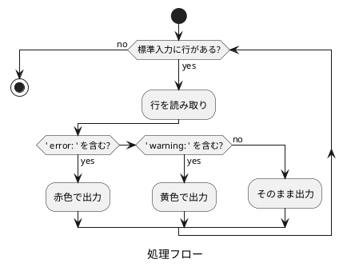

# doxygen-colorize-output.sh 仕様

## 概要

`doxygen-colorize-output.sh` は、Doxygen の出力メッセージに ANSI カラーコードを適用し、エラーとワーニングを視覚的に区別しやすくするフィルタースクリプトです。

## ファイルパス

```text
doxygen-colorize-output.sh
```

## 実行権限

実行可能 (chmod +x)

## 機能

標準入力から受け取った各行を解析し、エラーまたはワーニングメッセージを検出して着色します。

### 着色ルール

| メッセージタイプ | 検出パターン | ANSI カラーコード | 表示色 |
|------------------|--------------|-------------------|--------|
| エラー | ` error: ` | `\033[0;31m` | 🔴 赤 |
| ワーニング | ` warning: ` | `\033[0;33m` | 🟡 黄 |
| その他 | (該当なし) | (なし) | デフォルト |

## 実装詳細

### ANSI カラーコード定義

```bash
RED='\033[0;31m'
YELLOW='\033[0;33m'
RESET='\033[0m'
```

### 処理フロー



### マッチング条件

#### エラーの検出

```bash
if [[ "$line" == *" error: "* ]]; then
```

行内に ` error: ` (前後にスペースを含む) が含まれる場合にマッチします。

#### ワーニングの検出

```bash
elif [[ "$line" == *" warning: "* ]]; then
```

行内に ` warning: ` (前後にスペースを含む) が含まれる場合にマッチします。

### 誤検知の防止

スペースを含むパターンマッチングにより、以下のような誤検知を防止します。

- 変数名: `show_error_flag`, `warning_count`
- 関数名: `print_error()`, `handle_warning()`
- コメント内の単語: `// This is an error example`

## 使用方法

### makefile からの呼び出し

```bash
doxygen Doxyfile 2>&1 | ../doxyfw/doxygen-colorize-output.sh
```

- `2>&1`: stderr を stdout にリダイレクトして結合
- `|`: パイプでフィルタースクリプトに渡す

### 終了コードの保持

```bash
doxygen Doxyfile 2>&1 | ../doxyfw/doxygen-colorize-output.sh;
DOXYGEN_EXIT=${PIPESTATUS[0]};
exit $DOXYGEN_EXIT;
```

`PIPESTATUS[0]` を使用して、パイプの最初のコマンド (doxygen) の終了コードを取得し、ビルドの成否を正しく判定します。

## 出力例

### 着色前

```text
/path/to/file.c:42: warning: undocumented parameter 'foo'
/path/to/file.c:100: error: invalid syntax
Normal output line
```

### 着色後

(ターミナルでは以下のように表示されます)

<span style="color: #ffaa00">/path/to/file.c:42: warning: undocumented parameter 'foo'</span>
<span style="color: #ff0000">/path/to/file.c:100: error: invalid syntax</span>
Normal output line

## 制限事項

### ANSI カラーコード非対応環境

Windows コマンドプロンプトなど、ANSI カラーコードに対応していないターミナルでは、エスケープシーケンスがそのまま表示される可能性があります。

### ログファイルへの出力

ANSI カラーコードを含む出力をファイルにリダイレクトすると、エスケープシーケンスがそのまま記録されます。

ログファイルに保存する場合は、以下のいずれかの方法を推奨します。

- フィルターを適用せずに doxygen を直接実行
- `WARN_LOGFILE` 設定を使用して Doxygen が直接ログファイルに出力

## テスト方法

以下のコマンドでスクリプト単体のテストが可能です。

```bash
cat <<'EOF' | doxygen-colorize-output.sh
Normal output line
/path/to/file.c:42: warning: undocumented parameter 'foo'
Another normal line
/path/to/file.c:100: error: invalid syntax
More normal output
EOF
```

期待される結果: warning 行が黄色、error 行が赤色で表示されます。

## 関連ファイル

- `makefile`: 本スクリプトを doxygen 実行時に適用
- `Doxyfile`: Doxygen の警告フォーマット設定 (`WARN_FORMAT`)
- `docs-src/doxygen-colored-output-research.md`: 調査結果と背景情報
