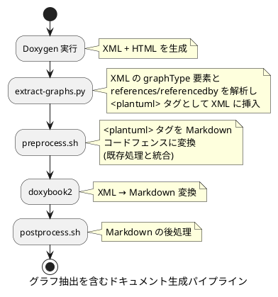
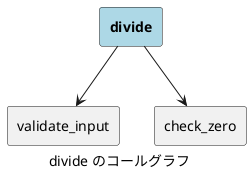
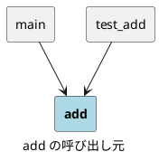
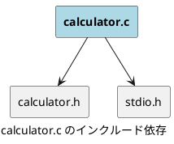
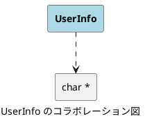

# Doxygen 関連図の Markdown 挿入

このドキュメントでは、Doxygen が生成するグラフ情報を Markdown 版ドキュメントに PlantUML 形式で自動挿入する仕組みについて説明します。

## 背景

Doxygen は HTML ドキュメント生成時に Graphviz (dot) を用いてコールグラフ、インクルード依存図、コラボレーション図などの SVG 画像を生成します。しかし、Doxybook2 を経由した Markdown 変換ではこれらのグラフ情報が失われます。

Doxybook2 はグラフデータをテンプレート変数として公開しておらず、プロジェクト自体も 2022 年にアーカイブされているため、今後の機能追加は見込めません。

本機能は、Doxygen XML に含まれるグラフ構造データを解析し、PlantUML 形式に変換して Markdown ドキュメントに挿入することで、この課題を解決します。

## 処理パイプライン

グラフ抽出は、既存のドキュメント生成パイプラインに統合されています。



`make docs` を実行すると、`extract-graphs.py` は `preprocess.sh` の前に自動的に呼び出されます。生成された `<plantuml>` タグは、既存の PlantUML 変換パイプラインによって Markdown コードフェンスに変換されます。

## 対応するグラフの種類

### ファイルレベルのグラフ

| グラフ種別 | XML ソース要素 | 説明 |
|---|---|---|
| インクルード依存 | `incdepgraph` | 対象ファイルがインクルードしているファイルの関係を示します |
| 被インクルード関係 | `invincdepgraph` | 対象ファイルをインクルードしているファイルの関係を示します |

### クラス/構造体レベルのグラフ

| グラフ種別 | XML ソース要素 | 説明 |
|---|---|---|
| 継承関係 | `inheritancegraph` | クラスの継承階層を示します |
| コラボレーション図 | `collaborationgraph` | クラス/構造体のメンバ型の関連を示します |

### 関数レベルのグラフ

| グラフ種別 | XML ソース要素 | 説明 |
|---|---|---|
| コールグラフ | `references` | 対象関数が呼び出す関数を示します |
| 呼び出し元グラフ | `referencedby` | 対象関数を呼び出す関数を示します |

## Doxygen XML のグラフデータ構造

### graphType 要素

`incdepgraph`、`invincdepgraph`、`inheritancegraph`、`collaborationgraph` は共通の `graphType` 構造を持ちます。

```xml
<incdepgraph>
  <node id="1">
    <label>calculator.c</label>
    <link refid="calculator_8c"/>
    <childnode refid="2" relation="include"/>
    <childnode refid="3" relation="include"/>
  </node>
  <node id="2">
    <label>calculator.h</label>
    <link refid="calculator_8h"/>
  </node>
  <node id="3">
    <label>stdio.h</label>
  </node>
</incdepgraph>
```

`node` 要素がグラフのノードを定義し、`childnode` 要素がノード間のエッジを定義します。`relation` 属性はエッジの種類を表します。

`relation` 属性の値と PlantUML 矢印の対応は以下の通りです。

| relation 値 | 意味 | PlantUML 矢印 |
|---|---|---|
| `include` | インクルード関係 | `-->` |
| `usage` | メンバ使用関係 | `..>` |
| `public-inheritance` | public 継承 | `--\|>` |
| `protected-inheritance` | protected 継承 | `--\|>` |
| `private-inheritance` | private 継承 | `--\|>` |

### references / referencedby 要素

関数間の呼び出し関係は、`memberdef` 要素の子要素として格納されます。

```xml
<memberdef kind="function" id="calculator_8c_1a001">
  <name>add</name>
  <!-- 略 -->
  <references refid="calculator_8c_1a005" compoundref="calculator_8c"
              startline="10" endline="10">validate_input</references>
  <referencedby refid="main_8c_1a099" compoundref="main_8c"
                startline="25" endline="25">main</referencedby>
</memberdef>
```

`references` は対象関数が呼び出す関数を、`referencedby` は対象関数を呼び出す関数を表します。

これらの要素を XML に含めるには、Doxyfile で以下の設定が必要です。

```text
REFERENCED_BY_RELATION = YES
REFERENCES_RELATION    = YES
```

## 生成される PlantUML の例

### コールグラフ

関数 `divide` が `validate_input` と `check_zero` を呼び出す場合、以下の PlantUML が生成されます。



### 呼び出し元グラフ

関数 `add` が `main` と `test_add` から呼び出される場合、以下の PlantUML が生成されます。



### インクルード依存グラフ

`calculator.c` が `calculator.h` と `stdio.h` をインクルードする場合、以下の PlantUML が生成されます。



### コラボレーション図

構造体 `UserInfo` が `char *` 型のメンバを持つ場合、以下の PlantUML が生成されます。



## 設定と制御

### グラフ生成の制御

グラフの生成は Doxyfile の設定によって制御されます。

| Doxyfile 設定 | 対応するグラフ |
|---|---|
| `INCLUDE_GRAPH = YES` | インクルード依存グラフ |
| `INCLUDED_BY_GRAPH = YES` | 被インクルード関係グラフ |
| `CLASS_GRAPH = YES` | 継承グラフ |
| `COLLABORATION_GRAPH = YES` | コラボレーション図 |
| `REFERENCES_RELATION = YES` | コールグラフ |
| `REFERENCED_BY_RELATION = YES` | 呼び出し元グラフ |

これらの設定を `NO` にすると、対応する XML 要素が生成されなくなり、Markdown への図の挿入もスキップされます。

### ノード数の上限

`extract-graphs.py` では、グラフあたりの最大ノード数を 20 に設定しています。この値を超えるグラフは生成をスキップします。上限値はスクリプト先頭の `MAX_GRAPH_NODES` 定数で変更できます。

```python
# グラフあたりの最大ノード数 (これを超えるグラフは生成しない)
MAX_GRAPH_NODES = 20
```

### スキップ条件

以下の条件に該当する場合、グラフの生成はスキップされます。

- ノード数が `MAX_GRAPH_NODES` を超える場合
- エッジが 1 つもない場合 (ノードが 1 つだけで関係のないグラフ)
- `index.xml` や `combine.xslt` 等のインデックスファイル

## 技術的な詳細

### XML 書式の保持

`extract-graphs.py` は XML の解析に正規表現ベースのテキスト操作を使用しています。ElementTree 等の XML パーサを用いた場合、ファイル再書き込み時に属性の順序変更、空要素の展開、名前空間宣言の変更などが発生する可能性があります。正規表現による操作は、変更箇所以外の XML 書式を完全に保持します。

### 挿入位置

生成された `<plantuml>` タグは、対象要素の `<detaileddescription>` 閉じタグの直前に `<para>` 要素で囲んで挿入されます。Doxybook2 はこれを Markdown の "Details" セクション内にテキストとして出力します。

```text
<detaileddescription>
  <para>既存の説明テキスト</para>
  <para><plantuml>
caption ... のコールグラフ
rectangle "**...**" as current #LightBlue
...
</plantuml></para>                        ← ここに挿入
</detaileddescription>
```

### PlantUML 変換の流れ

挿入された `<plantuml>` タグは、`preprocess.sh` の既存の変換ルールによって Markdown コードフェンスに変換されます。

```text
変換前 (XML):   <plantuml>caption Title ...</plantuml>
変換後 (テキスト): ```plantuml\n@startuml\ncaption Title ...@enduml\n```
```

doxybook2 はこのテキストを Markdown にそのまま出力するため、最終的な Markdown ファイルに PlantUML コードブロックが含まれます。
